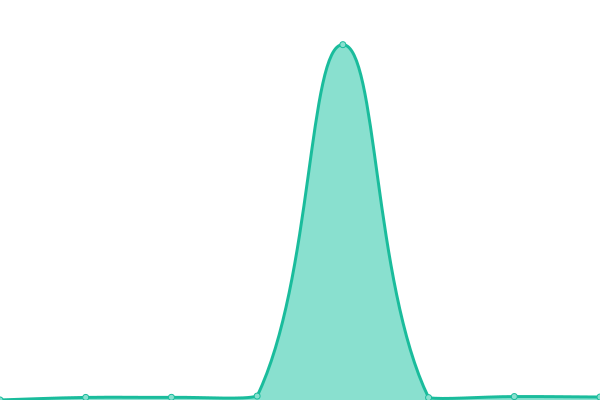
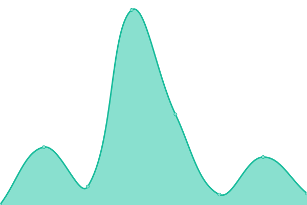
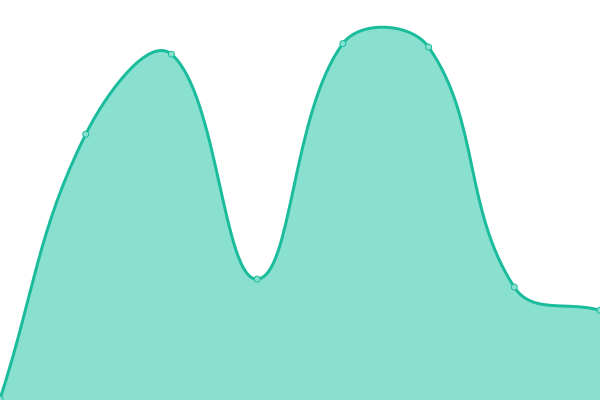
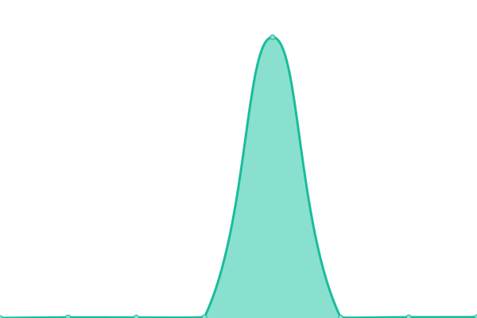
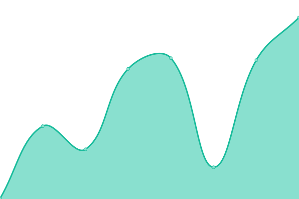
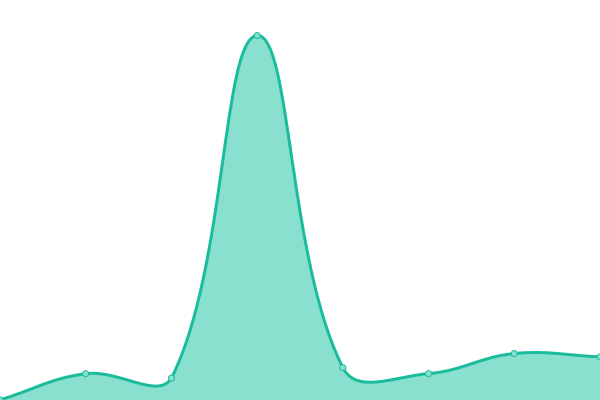

# [📈 Live Status](https://upptime.github.io/upptime): <!--live status--> **🟧 Partial outage**

This repository contains the open-source uptime monitor and status page for [Upptime](https://upptime.js.org), powered by [Upptime](https://github.com/upptime/upptime).

With [Upptime](https://upptime.js.org), you can get your own unlimited and free uptime monitor and status page, powered entirely by a GitHub repository. We use [Issues](https://github.com/upptime/upptime/issues) as incident reports, [Actions](https://github.com/Laeyoung/uptime-checker/actions) as uptime monitors, and [Pages](https://upptime.github.io/upptime) for the status page.

<!--start: status pages-->
<!-- This summary is generated by Upptime (https://github.com/upptime/upptime) -->
<!-- Do not edit this manually, your changes will be overwritten -->
<!-- prettier-ignore -->
| URL | Status | History | Response Time | Uptime |
| --- | ------ | ------- | ------------- | ------ |
|  [Google](https://www.google.com) | 🟩 Up | [google.yml](https://github.com/Laeyoung/uptime-checker/commits/HEAD/history/google.yml) | 

 120ms
     
 | 

<a href="https://Laeyoung.github.io/uptime-checker/history/google">100.00%</a>
    

|  [Wikipedia](https://en.wikipedia.org) | 🟩 Up | [wikipedia.yml](https://github.com/Laeyoung/uptime-checker/commits/HEAD/history/wikipedia.yml) | 

 244ms
     
 | 

<a href="https://Laeyoung.github.io/uptime-checker/history/wikipedia">100.00%</a>
    

|  [Hacker News](https://news.ycombinator.com) | 🟩 Up | [hacker-news.yml](https://github.com/Laeyoung/uptime-checker/commits/HEAD/history/hacker-news.yml) | 

 334ms
     
 | 

<a href="https://Laeyoung.github.io/uptime-checker/history/hacker-news">100.00%</a>
    

|  [Broken Site](https://thissitedoesnotexist.com) | 🟥 Down | [broken-site.yml](https://github.com/Laeyoung/uptime-checker/commits/HEAD/history/broken-site.yml) | 

 0ms
     
 | 

<a href="https://Laeyoung.github.io/uptime-checker/history/broken-site">100.00%</a>
    

|  [Test for HEAD](https://www.google.com) | 🟩 Up | [test-for-head.yml](https://github.com/Laeyoung/uptime-checker/commits/HEAD/history/test-for-head.yml) | 

 66ms
     
 | 

<a href="https://Laeyoung.github.io/uptime-checker/history/test-for-head">100.00%</a>
    

|  [ComCom](https://comcom.ai) | 🟩 Up | [com-com.yml](https://github.com/Laeyoung/uptime-checker/commits/HEAD/history/com-com.yml) | 

 421ms
     
 | 

<a href="https://Laeyoung.github.io/uptime-checker/history/com-com">100.00%</a>
    

|  [AINetwork](https://ainetwork.ai) | 🟩 Up | [ai-network.yml](https://github.com/Laeyoung/uptime-checker/commits/HEAD/history/ai-network.yml) | 

 1951ms
     
 | 

<a href="https://Laeyoung.github.io/uptime-checker/history/ai-network">100.00%</a>
    

|  Secret Site | 🟥 Down | [secret-site.yml](https://github.com/Laeyoung/uptime-checker/commits/HEAD/history/secret-site.yml) | 

 0ms
     
 | 

<a href="https://Laeyoung.github.io/uptime-checker/history/secret-site">100.00%</a>
    

<!--end: status pages-->

[**Visit our status website →**](https://upptime.github.io/upptime)

## 📄 License

- Powered by: [Upptime](https://github.com/upptime/upptime)
- Code: [MIT](./LICENSE) © [Upptime](https://upptime.js.org)
- Data in the `./history` directory: [Open Database License](https://opendatacommons.org/licenses/odbl/1-0/)
